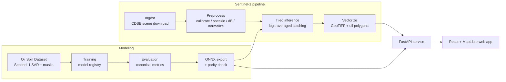
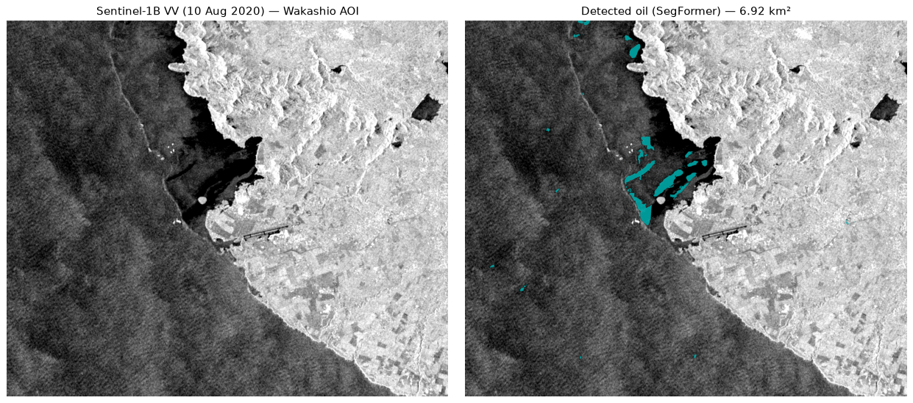

# Oil Spill Detection from Sentinel-1 SAR


Semantic segmentation of marine oil spills in Sentinel-1 C-band SAR imagery, with
an end-to-end pipeline that turns a raw Copernicus scene into georeferenced oil
polygons, served through a web API and an interactive map UI.

Oil slicks dampen the sea surface and appear as dark patches in SAR backscatter.
The hard part is not seeing dark patches — it is telling **oil** apart from
**look-alikes** (low-wind zones, biogenic films, rain cells) that look almost
identical in a single SAR channel. This project treats the problem as a five-class
segmentation task (sea surface, oil spill, look-alike, ship, land) and is judged
on how well it finds the oil specifically, not on overall pixel accuracy.

## Architecture



The model is trained and evaluated on the labelled dataset, exported to ONNX, and
reused as the inference engine for full Sentinel-1 scenes. The same ONNX model
backs the FastAPI service, which the web app calls for both single-image
prediction and full-scene AOI jobs.

## Results

All figures below are read directly from the committed evaluation outputs in
[`docs/results/`](docs/results/) (full test split, 110 images). The **headline
metric is oil-class IoU** — the task is finding oil, and overall pixel accuracy is
dominated by the sea-surface background. Pixel accuracy is shown only alongside the
per-class numbers, never as a summary figure; see [`docs/metrics.md`](docs/metrics.md)
for why.

| Model | Oil IoU | Oil recall | Mean IoU | Macro F1 | Pixel acc. |
| --- | --- | --- | --- | --- | --- |
| **SegFormer (mit-b2)** | **0.566** | **0.764** | **0.696** | **0.802** | 0.967 |
| U-Net (resnet34) | 0.542 | 0.685 | 0.635 | 0.747 | 0.953 |
| DeepLabV3+ (resnet50) | 0.481 | 0.651 | 0.581 | 0.695 | 0.929 |

SegFormer mit-b2 is the selected model. Full per-class IoU / precision / recall /
F1 for every run live in [`docs/results.md`](docs/results.md); the methodology and
the rationale for the metric choices are in [`docs/metrics.md`](docs/metrics.md).

## Case study: MV Wakashio (Mauritius, 2020)

The detection pipeline was run end-to-end on a real, previously unseen Sentinel-1B
scene over the August 2020 MV Wakashio spill off south-east Mauritius.



*Left: Sentinel-1B VV backscatter (10 August 2020). Right: oil detected by the
SegFormer model (cyan).*

The model places oil in the right location — along the south-east coastline and
lagoon around Pointe d'Esny, where the spill grounded — with high per-polygon
confidence, while the measured area is best read as an approximate lower bound for
the radiometric reasons documented in the write-up. Full event facts, sources, and
an honest discussion of errors are in
[`docs/case_study/README.md`](docs/case_study/README.md).

## Quickstart

Requires [uv](https://docs.astral.sh/uv/) and GNU Make.

```sh
uv sync
make check
```

`make check` runs lint (ruff), the formatting check, type checking (pyright), and
the fast test suite.

### Reproduce the pipeline (CPU smoke run)

A fast, CPU-only sanity reproduction — extract the data, run a short training
sanity pass, and evaluate the resulting checkpoint on a small slice of the test
split:

```sh
make data           # verify + extract the dataset and regenerate the data report
make train-smoke    # 2-epoch CPU sanity training on a small subset
make evaluate-smoke # evaluate the latest checkpoint on a test slice
```

Smoke runs are sanity checks, not representative of model quality — the headline
results above come from full GPU training runs.

### Run the app

```sh
docker compose up
```

Then open <http://localhost:7860>. The API and the built frontend are served from
the same container. The app runs without a trained model (the `/predict` endpoint
returns a clear 503 until one is available); point it at a published model by
setting `OILSPILL_MODEL_HF_REPO` (see comments in [`compose.yaml`](compose.yaml)).

### GPU training

Full training runs on GPU hardware via [Modal](https://modal.com):

```sh
uv run modal run scripts/modal_train.py::upload_data            # one-time data upload
uv run modal run scripts/modal_train.py::main --config configs/segformer.yaml --gpu L4
```

See [`scripts/modal_train.py`](scripts/modal_train.py) for collecting results.

## Limitations

- **Oil vs. look-alike confusion.** The hardest error mode: look-alikes share
  oil's dark SAR signature. They remain the lowest-IoU non-trivial class and the
  main source of false positives.
- **Small dataset.** 1002 training / 110 test images (official split), with oil
  occupying roughly 1% of pixels and a class imbalance near 89:1 — see
  [`docs/data_report.md`](docs/data_report.md).
- **Single polarization.** Training uses a single VV SAR channel (replicated to
  three so ImageNet-pretrained encoders apply); dual-pol information is not
  exploited.
- **Domain gap on raw scenes.** The model is trained on the dataset's preprocessed
  8-bit JPEG SAR chips, not on raw calibrated Sentinel-1 products. Running on real
  scenes (as in the case study) crosses a contrast/speckle/dynamic-range gap that
  biases detected area downward; closing it requires true sigma-nought calibration
  and matching the dB-to-model window to the training histogram.

## Original 2024 project

This repository is a modernization of an earlier 2024 graduation project. That
original work — including its results tables — is preserved on the
[`legacy-archive`](../../tree/legacy-archive) branch and summarized in
[`docs/legacy_content.md`](docs/legacy_content.md). The original metrics are
referenced only as "original 2024 results" and read with the caveats in
[`docs/metrics.md`](docs/metrics.md): they were largely background-dominated pixel
accuracy reported under mixed averaging schemes, so they cannot be compared
directly with the oil-class metrics reported here.

## Documentation

- [`docs/ARCHITECTURE.md`](docs/ARCHITECTURE.md) — package layout, model registry,
  pipeline stages, and the serving/reproducibility story.
- [`docs/results.md`](docs/results.md) / [`docs/metrics.md`](docs/metrics.md) —
  results and how quality is measured.
- [`docs/data_report.md`](docs/data_report.md) / [`data/README.md`](data/README.md)
  — dataset statistics and the class legend.
- [`docs/case_study/README.md`](docs/case_study/README.md) — the Wakashio case study.

## License

MIT — see [LICENSE](LICENSE).
