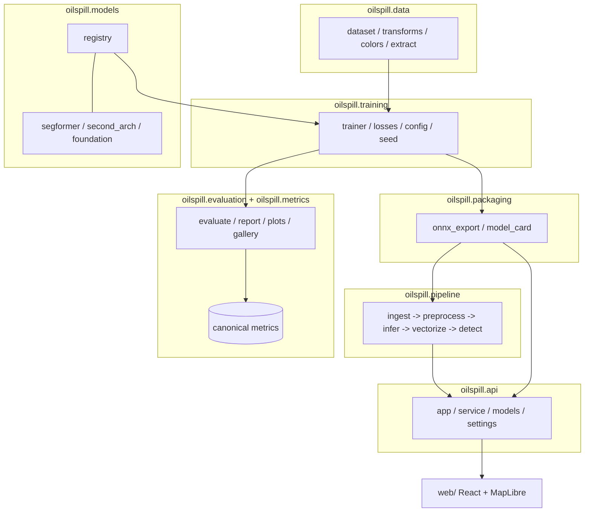
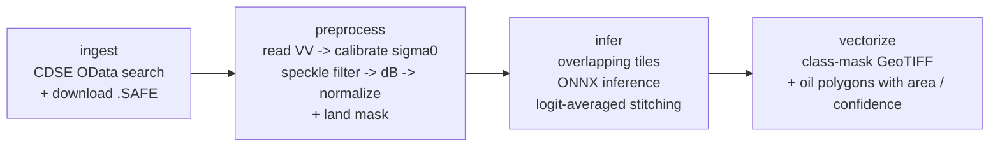

# Architecture

This document describes how the project is organized: the Python package layout,
the model registry, the canonical metrics module, the Sentinel-1 detection
pipeline, the inference/serving path, and the reproducibility and CI story. It is
intended to be accurate to the code in `src/oilspill/` and `scripts/`.

## Overview

The system has two halves that meet at an exported ONNX model:

1. **Modeling** — load the labelled dataset, train a segmentation model, evaluate
   it with one canonical metrics implementation, and export the selected model to
   ONNX.
2. **Operations** — take a raw Sentinel-1 scene, preprocess it, run tiled
   inference with the exported model, and vectorize the result into georeferenced
   oil polygons. The same model and pipeline back a FastAPI service and a static
   web frontend.

## Package layout

The installable package lives under `src/oilspill/`:

| Module | Responsibility |
| --- | --- |
| `oilspill.data` | Dataset loading and label handling. `dataset.py` reads the SAR images and the integer `labels_1D` masks and produces deterministic train/val/test splits; `transforms.py` handles augmentation/normalization; `colors.py` holds the canonical class legend; `extract.py` verifies and extracts the dataset archive. |
| `oilspill.models` | Architecture construction. `registry.py` is the single entry point (`build_model`); `segformer.py`, `second_arch.py`, and `foundation.py` are registered custom architectures. |
| `oilspill.training` | Training loop and configuration. `trainer.py` runs the loop; `config.py` defines the typed config schema; `losses.py` provides imbalance-aware losses; `seed.py` fixes seeds for reproducibility. |
| `oilspill.evaluation` | Evaluation harness: `evaluate.py` accumulates predictions, `report.py` writes `docs/results.md`/JSON, `plots.py` and `gallery.py` render figures, `model_loading.py` rebuilds a model from a checkpoint. |
| `oilspill.metrics` | The one canonical metrics implementation (see below). |
| `oilspill.packaging` | `onnx_export.py` exports a checkpoint to ONNX with a PyTorch parity check; `model_card.py` builds an honest Hugging Face model card. |
| `oilspill.pipeline` | The Sentinel-1 detection pipeline stages and their orchestration. |
| `oilspill.api` | The FastAPI application, request/response models, the inference service, and settings. |

CLI entry points in `scripts/` (`make_data.py`, `train.py`, `evaluate.py`,
`export_onnx.py`, `publish_hf.py`, `detect.py`, `serve.py`, `modal_train.py`,
`run_case_study.py`, `run_ablations.py`) wire these modules to the command line.

## Model registry

All architectures are built through a single function, `oilspill.models.registry.build_model`,
which is used by both the trainer and the evaluation harness so training and
checkpoint loading can never disagree on architecture. Resolution order for the
configured `arch` name:

1. A name registered with `@register_model` — custom architectures such as the
   Hugging Face SegFormer (`segformer.py`), the second architecture
   (`second_arch.py`), and an EO foundation model (`foundation.py`). Registration
   side effects are triggered by importing the modules listed in the registry, so
   there is one discoverable place where custom architectures are wired in.
2. Otherwise, a [`segmentation_models_pytorch`](https://github.com/qubvel-org/segmentation_models.pytorch)
   architecture (e.g. `Unet`, `DeepLabV3Plus`), constructed from the configured
   encoder.

A builder maps an `(N, in_channels, H, W)` float tensor to `(N, num_classes, H, W)`
logits. `pretrained=True` loads ImageNet/base encoder weights for training; for
evaluation it is `False` because the trained checkpoint weights are loaded
afterwards. Model, data, loss, optimizer, and runtime settings are all expressed
in the typed config schema in `oilspill.training.config` and driven from YAML files
under `configs/` (e.g. `segformer.yaml`, `unet.yaml`, `deeplabv3plus.yaml`, each
with a `_smoke` variant for fast sanity runs).

## Canonical metrics

`oilspill.metrics` is deliberately the only place metrics are computed — training,
evaluation, the API, and the documentation all route through it, and a
repository-wide check enforces that there is no second implementation.

Every metric is derived from one accumulated multiclass confusion matrix
(rows = ground truth, columns = prediction), built with `torchmetrics`. Per class,
the module reads off TP/FP/FN and computes IoU, precision, recall, and F1 by their
textbook definitions. Macro aggregates are `nanmean` over classes, so a class that
is genuinely absent from a split is reported as `nan` and excluded rather than
counted as 0 or 1. The two headline numbers — **oil-class IoU** and **oil-class
recall** — are chosen because the task is finding oil, and pixel accuracy is
dominated by the sea-surface background. The full rationale, and a critique of the
original 2024 reporting, is in [`metrics.md`](metrics.md).

## Sentinel-1 pipeline

The pipeline (`oilspill.pipeline`) turns a raw Sentinel-1 GRD product into
georeferenced oil polygons in four stages, orchestrated by `detect.py`:

- **`ingest`** queries the Copernicus Data Space Ecosystem (CDSE) OData catalogue
  for Sentinel-1 GRD scenes intersecting an AOI over a date range, and downloads
  the product archive with resume support.
- **`preprocess`** turns a raw GRD SAFE product into a model-ready tensor: read the
  VV measurement, calibrate to sigma-nought, apply a Lee speckle filter, convert to
  decibels, and normalize into the model's input range. It also produces the land
  mask used to suppress over-land false positives. Each step is a small, separately
  testable function so the radiometric chain can be unit-tested without a real SAFE.
- **`infer`** runs tiled ONNX inference: a full scene is far larger than the model's
  training resolution, so it is processed in overlapping tiles whose **logits** are
  averaged before the final softmax/argmax. Stitching in logit space avoids the
  blocky seams a hard-label vote would produce.
- **`vectorize`** writes the class mask as a GeoTIFF using the scene's affine
  transform and CRS, and converts oil-class pixels to polygons carrying per-polygon
  area (km²) and confidence.

`detect.py` exposes three input modes through the `scripts/detect.py` CLI: search +
download from CDSE (`--aoi`, the only networked mode), an already-downloaded
`.SAFE` (`--safe`), or a preprocessed model-ready scene (`--scene`).

## Inference and serving

The selected best model is exported to ONNX (`oilspill.packaging.onnx_export`, with
a parity check against the PyTorch model) and that single ONNX artifact is the
inference engine everywhere — the offline pipeline and the online API both consume
it, so there is no separate serving model to drift.

The API (`oilspill.api`, FastAPI) exposes:

| Endpoint | Purpose |
| --- | --- |
| `GET /healthz` | Liveness probe. |
| `GET /models` | Model registry with real evaluation metrics (from the committed results JSONs). |
| `GET /samples`, `GET /samples/{name}` | Preloaded sample images (list + raw bytes). |
| `POST /predict` | Segment one uploaded image. |
| `POST /jobs/scene` | Queue a full-scene AOI detection job. |
| `GET /jobs/{job_id}` | Poll a scene job. |

The service caches ONNX sessions and keeps an in-process job store, so a single
worker reuses both across requests. When `web/dist` exists it is mounted at `/`, so
the API also serves the built frontend. The frontend (`web/`, React + Vite +
TypeScript + MapLibre) has three views: **Quick Detect** (single-image predict with
an overlay and per-class legend), **Scene Monitor** (a MapLibre map for submitting
and polling AOI jobs and rendering oil polygons), and **Models** (the `/models`
table, with oil-class IoU highlighted as the headline and pixel accuracy labelled
secondary).

### Deployment

A multi-stage `Dockerfile` builds the frontend (`node`) and then a Python runtime
(the official `uv` image) that installs only the serving dependencies and copies in
the source, configs, sample images, and the per-model results JSONs. The container
listens on port 7860. The trained ONNX model is **not** baked into the image: the
entrypoint fetches it from the Hugging Face Hub at startup when
`OILSPILL_MODEL_HF_REPO` is set, and without it the API still serves and returns a
clear 503 from `/predict` until a model is present. `compose.yaml` runs the whole
app locally on <http://localhost:7860>.

## Reproducibility and CI

- **Deterministic data and splits.** `make data` verifies the dataset archive
  checksum, extracts it, and regenerates [`data_report.md`](data_report.md). Splits
  are deterministic from a fixed seed, so the same seed always yields identical,
  pairwise-disjoint train/val/test lists.
- **Traceable results.** `scripts/evaluate.py` emits a metrics JSON under
  `docs/results/` and updates [`results.md`](results.md) in place; every figure
  quoted in the docs traces back to one of those committed JSON files from a fresh
  clone.
- **One-command checks.** `make check` runs ruff lint, the ruff formatting check,
  pyright type checking, and the fast (`not slow`) test suite. `make train-smoke`
  and `make evaluate-smoke` give a fast CPU reproduction of the train/evaluate loop.
- **GPU training.** Full training runs on GPU hardware via Modal
  (`scripts/modal_train.py`): the dataset is uploaded once to a persistent volume,
  and runs are spawned server-side so they complete even if the local client
  disconnects.
- **Packaging.** `make export-onnx` exports the selected checkpoint to ONNX; `make
  publish` builds an honest model card and pushes the model to the Hub (dry-run by
  default).
- **Continuous integration.** The CI workflow runs the same `make check` gate so
  lint, formatting, types, and tests are enforced on every change.
